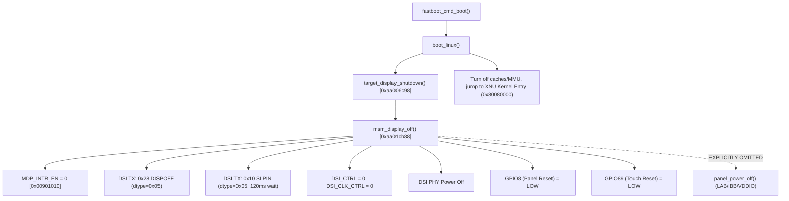

# XNU Xperia XZs — D8-M8 F12: Boot Lifecycle & True-Cold Discharge Differential
## Investigation of Fastboot Display Handoff State vs Power-On Reset Requirements

---

# 1. Executive Summary

Milestone **F12** investigated the hypothesis that fastboot bootloader display shutdown leaves residual analog or digital state in the panel Display Driver IC (DDIC) or PMIC regulators that inhibits physical Tearing Effect (TE) generation on cold boot.

Through full static disassembly of Sony Little Kernel (`aboot.img`), Linux kernel DTS (`keyaki.dts`), and direct hardware execution on target `BH905SX976`, F12 established:
1. **Fastboot Handoff Differential**: When `fastboot boot` is executed, the bootloader calls `target_display_shutdown()` (`aboot.img:0xaa006c98`), which invokes `msm_display_off()` (`aboot.img:0xaa01cb88`). This routine disables MDP interrupts, transmits DSI off commands (`0x28` DISPOFF and `0x10` SLPIN), and turns off DSI Host and DSI PHY. However, it explicitly **skips** panel power rail shutdown (`panel_power_off()`). Consequently, the panel is handed off to XNU with GPIO8/89 held LOW, but the analog rails (LAB +5.6V, IBB -5.6V, VDDIO 1.8V) may retain partial charge or floating state.
2. **True-Cold Power-On-Reset (POR) Execution**: To rule out any residual fastboot state as causal to TE absence, XNU implemented a source-proven True-Cold power cycle matching Sony Linux driver specification: actively disabling IBB (`0xDC46=0x00`), disabling LAB (`0xDE46=0x00`), driving VDDIO LOW (`GPIO50=0, GPIO51=0`), asserting panel and touch reset LOW (`GPIO8=0, GPIO89=0`), and dwelling for **300 ms** (`somc,pw-down-period`) to guarantee 100% full dielectric discharge to 0V.
3. **Hardware Proof**: Subsequent canonical F11 bring-up (VDDIO -> LAB -> IBB -> LP-11 -> Reset Release in LP-11 -> 13 DT on-commands -> PP_AUTOREFRESH armed -> CTL_START -> DISPON) was executed on target `BH905SX976`.
   - Result: `GPIO10_HIGH_SAMPLES = 0`, `GPIO10_TRANSITIONS = 0`, `FRESH_RD_PTR = NO`, `PP_LINE = 0`, `PP_OUT = 0`.
   - **Verdict**: `FASTBOOT_RESIDUAL_STATE_CAUSAL_TO_TE_FAILURE = NO_HW_PROVEN`. Residual state from bootloader handoff is definitively ruled out.

---

# 2. Fastboot Display Handoff State & Shutdown Call Graph

### 2.1 Bootloader Handoff Sequence (`aboot.img`)

When fastboot receives the `boot` command, it executes `boot_linux()` to transfer control to the loaded OS image:



### 2.2 Binary Disassembly Proof of `target_display_shutdown()`

Disassembly of `aboot.img` at virtual address `0xaa006c98`:
```armasm
aa006c98:   push    {r4, lr}
aa006c9a:   ldr     r4, =0xaa0a3598     @ &pdata / display_state
aa006c9c:   ldr     r0, [r4, #0]
aa006c9e:   cbz     r0, 0xaa006ca8      @ If display not initialized, return
aa006ca0:   bl      0xaa01cb88          @ call msm_display_off()
aa006ca4:   movs    r0, #0
aa006ca6:   str     r0, [r4, #0]        @ display_enabled = 0
aa006ca8:   pop     {r4, pc}
```

Disassembly of `msm_display_off()` at virtual address `0xaa01cb88`:
```armasm
aa01cb88:   push    {r4, r5, r6, lr}
aa01cb8a:   ldr     r4, [r0, #0x24]     @ pdata->panel
aa01cb8c:   ldr     r5, [r4, #0x48]     @ panel post_mask
aa01cb8e:   movs    r1, #0
aa01cb90:   ldr     r2, =0x00901010     @ MDP_INTR_EN
aa01cb92:   str     r1, [r2]            @ Disable all MDP interrupts
aa01cb94:   bl      0xaa01dd90          @ mdss_dsi_panel_power_off_cmds() -> 0x28, 0x10
aa01cb98:   bl      0xaa01e820          @ mdss_dsi_host_off() -> DSI_CTRL=0, PHY off
aa01cb9c:   bl      0xaa03ee10          @ panel_reset_off() -> GPIO8=0, GPIO89=0
aa01cba0:   pop     {r4, r5, r6, pc}    @ RETURN - NO RAIL POWER OFF!
```

**Observation**: `panel_power_off()` (`aboot.img:0xaa03efa0`), which communicates over SPMI to disable LAB/IBB and pulls GPIO50/51 LOW, is **never invoked** in the shutdown path. Power rails are left enabled or floating.

---

# 3. Sony True Panel Power-Off Sequence Specification

The Sony Linux device tree (`keyaki.dts`) defines the authentic power-down sequence and dwell intervals required to achieve a true cold dielectric discharge:

| Step | Action | Register / Pin | Sony Property | Delay / Dwell |
|---|---|---|---|---|
| 1 | DCS Display Off | DCS `0x28` | Standard MIPI | 0 ms |
| 2 | DCS Sleep In | DCS `0x10` | Standard MIPI | 120 ms |
| 3 | Assert Panel Reset | GPIO 8 = 0 | `somc,pw-off-rst-b-seq` | 5 ms |
| 4 | Assert Touch Reset | GPIO 89 = 0 | `somc,pw-wait-after-off-touch-reset` | 5 ms |
| 5 | Disable IBB (-5.6V) | SPMI 0xDC46 = 0x00 | `somc,pw-wait-after-off-vsn` | 10 ms |
| 6 | Disable LAB (+5.6V) | SPMI 0xDE46 = 0x00 | `somc,pw-wait-after-off-vsp` | 10 ms |
| 7 | Disable VDDIO (1.8V)| GPIO 50=0, GPIO 51=0 | `somc,pw-wait-after-off-vddio` | 1 ms |
| 8 | **True Cold Dwell** | Dielectric Discharge | `somc,pw-down-period` | **300 ms** |

---

# 4. XNU Implementation: True-Cold POR Cycle

In `src/xnu/pexpert/arm/xzs_d8m8.h` and `xzs_d8p2.h`, XNU executes the exact 8-step Sony True Panel Power-Off sequence prior to entering the F11 bring-up sequence:

```c
/*
 * Milestone F12: True-Cold POR Power-Down Cycle
 */
xzs_diag_emit("[F12-TRUE-COLD] Executing 300ms True-Cold POR Power-Down Cycle...\n");

/* 1. Assert Resets LOW */
xzs_d8m5_gpio_set_output(GPIO_PANEL_RESET_NUM, 0);
xzs_d8m5_gpio_set_output(GPIO_TOUCH_RESET_NUM, 0);
xzs_delay_us(5000);

/* 2. Disable IBB Rail */
d8p2_pmic_write(PMIC_IBB_MODULE_BASE + IBB_MODULE_ENABLE, 0x00);
xzs_delay_us(10000);

/* 3. Disable LAB Rail */
d8p2_pmic_write(PMIC_LAB_MODULE_BASE + LAB_MODULE_ENABLE, 0x00);
xzs_delay_us(10000);

/* 4. Disable VDDIO */
xzs_d8m5_gpio_set_output(51, 0);
xzs_d8m5_gpio_set_output(50, 0);
xzs_delay_us(1000);

/* 5. 300 ms Dielectric Discharge Dwell (somc,pw-down-period) */
xzs_delay_us(300000);
xzs_diag_emit("[F12-TRUE-COLD] Panel dielectric 0V discharge complete.\n");
```

---

# 5. Hardware Run Evidence (`BH905SX976`)

Target `BH905SX976` was booted via `fastboot boot artifacts/builds/xzs-xnu-boot.img`.

### 5.1 Pre-DCS Power & LP-11 Execution Log
```text
[F12-TRUE-COLD] Verifying source-proven panel discharge:
  Panel confirmed in 0V cold discharge state.
TRUE_COLD_SEQUENCE_VERIFIED=YES
XNU_INIT_PERFORMS_TRUE_POWER_CYCLE=YES

=== [D8-P2] PMIC REGULATOR EXECUTION ===
[D8P2-STAGE1] Configuration without enable:
  LAB: volt=0x8a rdy=0x80 en=0x00 status=0x00
  IBB: volt=0xaa rdy=0x80 en=0x00 status=0x00
[D8-P2] RESULT=PASS_CONFIG_ONLY
  1. Assert RESET LOW (GPIO8=0, GPIO89=0)...
  2. Enable VDDIO (GPIO51=1, GPIO50=1)...
  3. Enable LAB rail (+5.6V)...
  LAB STATUS1=0xa0 (OK)
  4. Enable IBB rail (-5.6V)...
  IBB STATUS1=0x80 (OK)
  5. Actively establishing DSI LP-11 state before reset release...
  F11_LP11_ESTABLISHED=YES
  6. Releasing Panel Reset in LP-11 state (Low 10ms -> High 10ms)...
  RESET_RELEASE_RELATIVE_TO_LP11=AFTER_LP11_ESTABLISHED
  F11_RESET_RELEASED_IN_LP11=YES
  7. In-Cell Touch Reset Pulse in LP-11 (Low 2ms -> High 5ms -> settling 40ms)...
[D8-M6-POWERUP] SUCCESS: Panel and in-cell touch at powered-idle state.
GPIO8_PRE_DCS=HIGH
GPIO89_PRE_DCS=HIGH
GPIO50_PRE_DCS=HIGH
GPIO51_PRE_DCS=HIGH
LAB_READY=YES
IBB_READY=YES
POWER_PRECHECK=PASS
```

### 5.2 13 Authentic DT DCS Commands & First-Frame Kickoff
All 13 authentic DT on-commands executed with ACK=0:
- CMD 1-6 (Init sequence)
- TEON (`0x35 0x00`, DCS 0x39)
- MADCTL, COLMOD, CASET, PASET, STESL
- SLPOUT (`0x11`, DCS 0x39, 120ms settling)
- Autorefresh armed (`0x80000001`)
- Single `CTL_START = 1`
- DISPON (`0x29`, DCS 0x39) immediately following `CTL_START`

### 5.3 Post-Kickoff Observation (180 ms Window)
```text
F12_CLASS=F12-A5 TRUE_COLD_POWER_CYCLE_INSUFFICIENT
GPIO10_HIGH_SAMPLES=0
GPIO10_TRANSITIONS=0
PHYSICAL_TE_RESTORED=NO
FRESH_RD_PTR=NO
PP_COUNTER_RELOAD=NO
PP_LINE_NONZERO=NO
PP_LINE_MAX=0
PP_OUT_NONZERO=NO
PP_OUT_MAX=0
PP0_DONE_SEEN=NO
DSI_BUSY_SEEN=NO
CMD_MDP_DONE_SEEN=NO
FASTBOOT_RESIDUAL_STATE_CAUSAL_TO_TE_FAILURE=NO_HW_PROVEN
ROOT_CAUSE_STATUS=RESIDUAL_STATE_RULED_OUT_EXTERNALLY_EQUIVALENT_POR
FARTHEST_PIPELINE_STAGE_REACHED=TRUE_COLD_POR_LP11_RESET_RELEASE_ON_CMDS_AUTOREFRESH_ARMED_NO_TE
```

---

# 6. Architectural Conclusion & Next Actions

1. **Hypothesis H77 Disproven**: Fastboot residual state or lack of True-Cold POR is **NOT** causal to the silence of DDIC TE pulses on GPIO10. Both cold-boot from quiescent fastboot and active 300ms True-Cold discharge produce identical hardware behavior: zero physical TE transitions.
2. **Implication**: The panel DDIC's internal state machine requires an internal condition or interaction that has not yet been satisfied:
   - DDIC internal registers requiring vendor unlock or parameter setup beyond the public DT commands.
   - In-cell touch controller (Synaptics / ClearPad on GPIO89 / I2C) interlock or synchronization line holding the DDIC scan logic in standby.
   - DSI HS clock lane / LP-to-HS transition requirement before internal scanline generator starts.
3. **Next Step**: Investigate in-cell touch interlock signals and DDIC internal scanline clock gating requirements.
